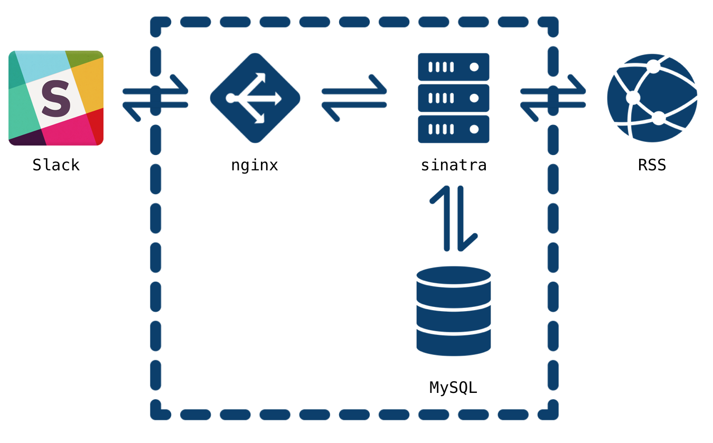

# rss2slack

[](https://circleci.com/gh/naoto0822/rss2slack)
[](https://github.com/naoto0822/rss2slack/blob/master/LICENSE)

rss2slack is RssReader using slack.

## worker timing

| time | desc                   |
|:----:|:----------------------:|
| 7:00 | fetch feed             |
| 8:00 | post articles to slack |

## Required

> Actually it is one server...



### Ruby

- 2.4.0

### Structure

|    env     |   name     |
|:----------:|:----------:|
| OS         | CentOS 7.x |
| web server | nginx      |
| app server | unicorn    |
| database   | MySQL 5.7  |

## Provision

### dev or staging

```sh
$ vagrant up
$ sh (dev_playbook.sh|staging_playbook.sh)
```

### prod

```sh
$ cd ./playbook
$ sh prod_init_playbook.sh
$ sh prod_playbook.sh
```

## Deploy

```sh
$ bundle exec cap (staging|production) deploy
```

## TODO

- [ ] Log rotate
- [ ] Log monitoring

## MEMO
- https://www.sitepoint.com/building-a-slackbot-with-ruby-and-sinatra/
- https://moneyforward.com/engineers_blog/2015/02/18/slack-timer/

